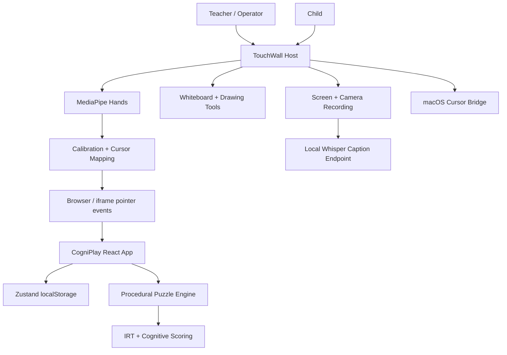

# NeoTouch / CogniPlay Executive Audit and Teaching Summary

Date: 2026-06-03  
Workspace: `/Users/rajivkhanna/Downloads/NeoTouch`  
Evidence used:

- Current repository source and git diffs
- Product testing PDF: `/Users/rajivkhanna/Library/Containers/net.whatsapp.WhatsApp/Data/tmp/documents/8BFB7E3B-4339-4207-8755-A292B1CB155C/e13b3959-1a7c-41b1-8077-964d5eb0b6f4.pdf`
- Extracted PDF screenshots: `/Users/rajivkhanna/Downloads/NeoTouch/pdf_extracted_images`
- Build check: `npm run build` passed in `CogniPlay/cogniplay`
- Syntax check: `node --check server.js` passed

## Executive Summary

NeoTouch / CogniPlay has moved from a broad hackathon concept into a clearer classroom product: **a local-first interactive learning wall for ages 3 to 5, combining hand-tracked wall control, preschool cognitive play, drawing, recording, and teacher/parent insight screens**.

The latest changes sharpen the product in four important ways:

1. The child-facing product is now more focused on **ages 3 to 5** instead of trying to serve all ages 3 to 12.
2. The game flow now supports more natural early-childhood interactions: **drag/drop, tracing, memory reveal, zoom/pan, and a separate Drawing Studio**.
3. The teaching layer is stronger: **whiteboard, PDF support, AI flowchart/answer tools, screen recording, camera picture-in-picture, and local live subtitles via Whisper/whisper.cpp**.
4. The live testing PDF shows the product running with **CV Active**, projected screen preview, puzzle play, whiteboard, recording, Learning DNA, Parent Dashboard, and Teacher Dashboard.

The product is now a much better demo and a more coherent early-learning platform. It is still not institution-ready because it has no real authentication, database, cloud sync, class roster, admin system, or validated assessment backend. Teacher analytics are still demo/mock data.

## Product Positioning

### One-Line Description

CogniPlay Studio turns any projected wall into a touch-driven, AI-assisted early-learning surface for preschool classrooms.

### Best Current Pitch

For preschools, early learning centers, and therapy classrooms, CogniPlay Studio provides a low-cost alternative to smart boards by using a projector, webcam, local computer vision, and adaptive cognitive games.

### Target Users

| User | Current Support | Notes |
|---|---|---|
| Child learner | Strong | Core flow is built and tested visually. |
| Teacher | Medium | Host wall, whiteboard, recording, and demo dashboard exist. |
| Parent | Medium | Parent dashboard uses local profile data plus mock weekly chart. |
| School administrator | Missing | No admin portal, roles, or school setup. |
| Recruiter | Missing | Not relevant to current preschool product. |

## Live Product Testing Evidence From PDF

The PDF is image-only, so the screenshots were extracted and visually inspected.

### Landing and CV-Active Wall Host

Observed:

- CogniPlay Studio host is running.
- Top navigation includes Puzzle Playground, Whiteboard, Recording, and CV Engine.
- System status shows **CV Active**.
- Right setup dock shows hand tracking controls and live camera preview.
- Landing copy is focused on "ages 3 to 5".

### Home World and Puzzle Groups

Observed:

- World selection now includes Shape Island, Pattern Room, Memory Train, and Drawing Studio.
- Puzzle Groups are available as skill filters.
- Progress language is child-friendly: "Sticker shelf", "sparkles", "stickers".
- A live camera preview shows the projected wall, which supports the product-testing claim.

### Puzzle Play

Observed:

- Child-facing puzzle copy is clear and simple.
- Drag/drop interaction is visible.
- The "Drop the piece here" zone makes wall interaction more natural.
- The cursor is visible as a hand-tracked ring.

### Whiteboard and AI Teaching Tool

Observed:

- Whiteboard has colors, brush, eraser, laser, undo/redo, size controls, and clear.
- AI Shape Assist is visible.
- A flowchart has been generated on the board, showing teaching use beyond freehand drawing.

### Recording and Local Subtitles

Observed:

- Recording tab now explicitly says local live subtitles are burned into recording when Whisper is installed.
- Buttons include Start Recording, Upload to Cloud, and Start Live Subtitles.
- Subtitle preview area is present.

### Learning DNA

Observed:

- Learner profile shows score, level, streak, solved count, XP, and radar chart.
- This is the strongest parent/student evidence screen for "adaptive cognitive profiling".

### Parent Dashboard

Observed:

- Parent dashboard shows plain-language summary, score, day streak, puzzles solved, and strengths.
- Strength labels are parent-friendly: Shape Thinking, Focus Power, Never Give Up.

### Teacher Dashboard

Observed:

- Teacher dashboard shows class cognitive profile, score distribution, cognitive heatmap, alerts, and recommendations.
- Current caveat: this screen is still powered by hardcoded mock student data, not real class data.

## Teaching Summary

### What Teachers Can Do Today

Teachers can use the system as a live classroom surface:

- Start hand tracking and operate the projected wall.
- Run simple preschool cognitive activities.
- Use drag/drop and trace activities for embodied play.
- Open a whiteboard for drawing, explaining, and AI-assisted diagrams.
- Use recording with picture-in-picture.
- Start local subtitles if Whisper or whisper.cpp is installed.
- Show a parent-style or teacher-style progress screen during demos.

### Best Teaching Use Cases

| Use Case | How the Product Supports It | Current Strength |
|---|---|---|
| Circle-time learning | Project CogniPlay on wall and let children answer with gestures | Strong demo |
| Shape and pattern learning | Shape Island, Pattern Room, drag/drop puzzles | Strong |
| Motor coordination | Trace mazes and wall pointer interaction | Medium to strong |
| Memory practice | Memory Train / Memory Lights reveal flow | Medium |
| Teacher explanation | Whiteboard, AI flowchart, PDF overlay | Medium to strong |
| Inclusive classroom capture | Recording and local subtitles | Partial, depends on Whisper |
| Parent conversation | Learning DNA and Parent Dashboard | Medium |
| Teacher intervention | Teacher Dashboard alerts/recommendations | Demo only |

### Teaching Value Proposition

CogniPlay is strongest when positioned as a **guided preschool learning station**, not as a full LMS. The core value is embodied learning: children touch, trace, sort, and draw at wall scale while the system quietly builds a local learning profile.

### Recommended Classroom Flow

1. Teacher opens CogniPlay Studio and starts hand tracking.
2. Teacher calibrates the wall if needed.
3. Child selects or continues a learner profile.
4. Teacher chooses a world or skill group.
5. Child plays 5-10 short activities.
6. Teacher uses whiteboard for reinforcement.
7. Teacher records the session when needed.
8. Parent/teacher reviews Learning DNA and dashboard summaries.

## Updated Feature Assessment

| Feature | Status After Changes | Notes |
|---|---|---|
| CV wall host | Implemented | Live PDF shows CV Active and camera preview. |
| Projector calibration | Implemented/partial | Manual and marker calibration controls exist. |
| CogniPlay game shell | Implemented | Build passes. |
| Vite `/cogniplay/` deployment base | Improved | `vite.config.ts` now sets `base: '/cogniplay/'`. |
| Age focus | Improved | UI now focuses on ages 3 to 5. |
| Learner profiles | Improved | Store now supports multiple saved local players. |
| Puzzle group selection | Improved | Skill filtering persists per local player. |
| Drag/drop puzzles | Improved | PuzzleBoard now supports drop zones and direct answer. |
| Trace maze puzzles | Improved | PuzzleBoard now traces path and detects wall collisions. |
| Memory reveal | Improved | Memory puzzles hide choices until after a reveal period. |
| Drawing Studio route | New | `/studio` page exists and is linked from Drawing Studio world. |
| Whiteboard AI | Partial | Live flowchart visible; still local/browser-based. |
| Recording | Improved | Screen/camera recording exists with caption burn-in logic. |
| Local subtitles | New/partial | Requires local Whisper or whisper.cpp. |
| Parent dashboard | Partial | Uses local profile, but weekly chart is mock. |
| Teacher dashboard | Placeholder | Uses hardcoded `MOCK_STUDENTS`. |
| AI puzzle generation | Still disabled | `generatePuzzleAI` returns procedural puzzle immediately. |
| Auth/database | Missing | No production data layer. |
| Admin workflows | Missing | No school administration. |

## Architecture Update

## Current Technical Findings

### Positive

- `npm run build` passes for CogniPlay.
- `node --check server.js` passes.
- The live PDF shows the product working in wall/projection mode.
- Vite deployment base is correctly set to `/cogniplay/`.
- UX is more coherent and preschool-focused.
- Recording/subtitles are no longer just static text; implementation exists.

### Important Gaps

- No backend database.
- No authentication or roles.
- No real teacher roster.
- No real parent/teacher account linking.
- Teacher dashboard is mock data.
- Parent weekly chart appears mock/static.
- Local subtitles depend on installed Whisper; not guaranteed by app itself.
- Upload to Cloud is still not a complete cloud workflow.
- AI puzzle generation remains disabled by early return.
- Product claims should avoid "15 fully implemented categories" unless the simplified template mapping is intentional and disclosed.

## Investor Readout

### Stronger Than Before

The project now looks more like a sellable classroom demo. The PDF evidence is valuable because it shows real wall projection, CV active state, the side camera preview, and multiple product surfaces running.

### Still Not Yet Investable as SaaS

The core barrier is not UI anymore. The main barrier is institutional readiness:

- accounts
- privacy
- school/class data model
- reporting
- deployment reliability
- evidence that the cognitive scoring is valid

### Updated Startup Score

Current prototype score: **7.0 / 10**  
Previous score was lower because the product was less focused and more placeholder-heavy.

Potential after backend, classroom pilots, real teacher data, and validated learning outcomes: **8.2 / 10**

## Hackathon / Demo Readout

### Strengths

- Very visual.
- Strong "any wall becomes smart" hook.
- Live CV status and camera preview prove the hardware story.
- AI whiteboard/flowchart makes the teaching demo more memorable.
- Parent and teacher dashboards create a full stakeholder story.

### Risks in Demo

- Calibration or webcam permissions can fail live.
- Whisper may not be installed, so subtitles may show setup error.
- Teacher dashboard questions may expose mock data.
- If judges ask about database/auth, answer honestly: local-first prototype.

### Updated Hackathon Score

| Category | Score |
|---|---:|
| Innovation | 8.5 / 10 |
| Technical Complexity | 8.5 / 10 |
| Educational Impact | 8.0 / 10 |
| Demo Quality | 8.5 / 10 |
| Scalability | 5.5 / 10 |
| Overall Winning Potential | 8.0 / 10 |

## Recommended Executive Story

Use this narrative:

> CogniPlay Studio is a local-first AI classroom wall for preschool learning. It uses ordinary hardware - a webcam, projector, and Mac - to create a touch-enabled learning surface. Children learn through movement: tracing, sorting, matching, drawing, and memory games. Teachers get a whiteboard, recording, local subtitles, and classroom insight dashboards. Parents get plain-language Learning DNA summaries.

Be careful with these claims:

- Say "prototype teacher dashboard" unless real student data is connected.
- Say "local subtitles when Whisper is installed" rather than "automatic subtitles always work".
- Say "adaptive scoring prototype" rather than "validated cognitive assessment".
- Say "local-first profile storage" rather than "secure institutional database".

## Roadmap

### High Priority

- Add backend database and auth.
- Replace mock teacher data with real class/student records.
- Add parent/teacher/student account linking.
- Decide whether AI puzzle generation should be enabled or removed.
- Add school/privacy consent model.
- Add exportable reports for teachers and parents.
- Add onboarding and checks for webcam, calibration, and Whisper.

### Medium Priority

- Validate cognitive scoring with educator review.
- Add lesson plans and teacher session summaries.
- Add class mode: choose multiple learners in one session.
- Add saved whiteboards and recording library.
- Add better accessibility controls.
- Add automated browser tests for all main screens.

### Low Priority

- Add multiplayer or group activities.
- Add LMS integrations.
- Add mobile companion app.
- Add more polished investor deck assets.

## Final Conclusion

The updated product is meaningfully stronger than the earlier audit version. The live PDF demonstrates a coherent classroom experience: wall host, CV tracking, preschool games, whiteboard, recording, profile, parent dashboard, and teacher analytics.

The founder-facing recommendation is to position the product as:

**"A local-first AI-powered interactive learning wall for preschool classrooms."**

The next major milestone is not more UI. It is turning the prototype into an institution-ready platform with real users, real data, and real classroom evidence.

