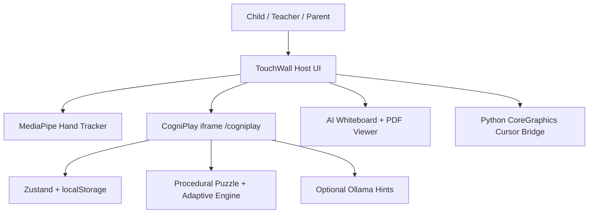

# NeoTouch / CogniPlay Master Audit Report

Generated from a read-only repository inspection of `/Users/rajivkhanna/Downloads/NeoTouch`.

## Executive Summary

The project is really two products joined together:

1. **TouchWall / NeoTouch**: a webcam-based interactive projector/touch-wall host.
2. **CogniPlay**: an embedded React cognitive learning game.

The strongest product story is: **turn any wall into an AI-assisted preschool learning surface**.

The current implementation is impressive as a prototype, but not yet a production SaaS. There is no real database, no authentication, no cloud backend, no real class roster, and several dashboard/integration claims are mock or placeholder.

Key evidence:

- Root host UI and iframe mount: `index.html`
- Node static/cursor server: `server.js`
- CogniPlay routes: `CogniPlay/cogniplay/src/App.tsx`
- Local persisted game store: `CogniPlay/cogniplay/src/stores/gameStore.ts`

## Tech Stack Report

| Layer | What Is Used | Why / Interaction |
|---|---|---|
| Host frontend | Plain HTML/CSS/JS | Runs projector dashboard, whiteboard, calibration, recording placeholders, CV debugger. |
| Hand tracking | MediaPipe Hands CDN | Loaded from jsDelivr; converts webcam hand landmarks into cursor/touch gestures. |
| Host backend | Native Node `http`, `fs`, `path`, `child_process` | Serves static files and `/cursor` endpoints without npm dependencies. |
| OS integration | Python + macOS CoreGraphics | `cursor-bridge.py` moves/clicks/scrolls the system cursor. Requires Accessibility permission. |
| CogniPlay app | React 19, TypeScript, Vite 8 | Modern frontend app for the game layer. |
| State | Zustand + `localStorage` persist | Stores player, profile, progress, and last 200 attempts under `cogniplay-storage`. |
| Routing | React Router | Seven routes: landing, age select, worlds, play, profile, teacher, parent. |
| Charts | Recharts | Used for radar, line, and bar visualizations. |
| Animations | Framer Motion | Used throughout CogniPlay for transitions, buttons, confetti, cards. |
| AI | Local Ollama `llama3`, procedural fallbacks | Whiteboard AI calls Ollama; CogniPlay hints can call Ollama. CogniPlay puzzle AI is currently unreachable because of an early return in `AIEngine.ts`. |
| Database | None | No SQL, Prisma, Firebase, Supabase, Mongo, or server persistence found. |
| Auth | None | No login/session/role permission system found. |
| Deployment | Root Node server + built CogniPlay `dist` | `/cogniplay` is served from `CogniPlay/cogniplay/dist`; if missing, server says to build it. |

## Product Understanding

The built product is an interactive wall learning environment for young children, teachers, and parents.

The root host targets:

- classrooms
- labs
- therapy rooms
- projector-based learning spaces
- institutions that want a smart-board-like experience without buying a dedicated smart board

CogniPlay targets children aged 3-12 in the type system, but actual UI copy emphasizes ages 3-5.

Implemented stakeholders:

- **Student / child**: implemented.
- **Parent**: partially implemented.
- **Teacher**: demo dashboard implemented with mock data.
- **Administrator**: missing.
- **Recruiter**: missing.

## System Interaction Map

Interaction sequence:

1. User interacts by hand, touch, mouse, or keyboard.
2. TouchWall host captures webcam input through MediaPipe.
3. Hand landmarks become cursor coordinates.
4. Calibration maps camera space to projector/screen space.
5. Gestures synthesize browser clicks, iframe events, whiteboard strokes, or OS cursor events.
6. CogniPlay generates puzzles locally.
7. Attempts update local cognitive profile and progress.
8. Optional Ollama calls generate hints or whiteboard content.
9. Analytics are displayed locally in profile/parent dashboards, while teacher dashboard uses mock data.

## Feature Inventory

| Feature | User | Inputs | Outputs | AI Used | Business Value | Status |
|---|---|---|---|---|---|---|
| Projector hand tracking | Teacher/operator | Webcam, MediaPipe landmarks | Cursor, gestures, telemetry | No | Turns wall into interactive surface | Partial, hardware-dependent |
| 4-point calibration | Operator | Corner touches/clicks | Homography/grid mapping | No | Aligns camera to projection | Implemented |
| Auto calibration | Operator | Color marker detection | Calibration points | CV only | Reduces setup friction | Partial |
| System cursor control | Operator | Cursor coordinates | macOS mouse/scroll events | No | Controls full OS from wall | Implemented for macOS |
| CogniPlay iframe | Student | Embedded route | Puzzle game inside wall UI | Optional hints | Core learning product | Implemented |
| Whiteboard | Teacher/student | Drawing/touch strokes | Canvas strokes, text, eraser, undo/redo | Shape classifier/Ollama | Classroom teaching surface | Partial |
| AI shape assist | Teacher/student | Stroke points | Clean circle/rect/triangle/line | Rule-based “AI” | Makes drawing polished | Implemented |
| AI sketch/text/flowchart/table | Teacher | Prompt | Canvas drawing/text/chart | Ollama + fallback | AI teaching copilot | Partial |
| PDF viewer overlay | Teacher | PDF upload | Browser object URL in iframe | No | Present worksheets/slides | Partial |
| Recording/subtitles/upload | Teacher | Button clicks | Status text only | Claimed Google STT | Lecture capture story | Placeholder |
| Laser Pop game | Student | Hover/pinch | Score/timer game | No | Engagement demo | Partial; tab not exposed in current top nav |
| Age/name setup | Student/parent | Name, age group | Player profile | No | Personalizes game | Implemented |
| World select | Student | World/category choices | Starts puzzle | No | Child-friendly navigation | Implemented |
| Puzzle play | Student | Select/drop/trace/zoom | Attempts, result, XP, stars | Optional hint | Core learning loop | Implemented |
| Adaptive difficulty | Student | Attempt history | Next difficulty/category | Statistical, not LLM | Personalization | Implemented |
| Cognitive profile | Parent/student | Attempts | 7 dimension scores | No | Learning insight | Implemented locally |
| Badges/XP/levels | Student | Attempts | Rewards | No | Motivation | Implemented, world completion incomplete |
| Parent dashboard | Parent | Local profile + mock week | Strengths, growth, activities | No | Parent visibility | Partial |
| Teacher dashboard | Teacher | Hardcoded mock class | Heatmap, alerts, actions | No | Institutional pitch | Placeholder/demo |
| Admin dashboard | Admin | None | None | No | School operations | Missing |
| Recruiter workflow | Recruiter | None | None | No | Employability story | Missing |

## User Journeys

### Student Journey

1. Landing page.
2. Enter name.
3. Select age group.
4. Choose a world.
5. Optionally select puzzle groups.
6. Start puzzle.
7. Select, drag/drop, trace, zoom, or request hint.
8. Submit answer.
9. Receive result, XP, stars, and possibly badges.
10. Continue to next puzzle.
11. View profile / Learning DNA.

### Teacher Journey

1. Open root TouchWall host.
2. Start hand tracking.
3. Calibrate projector wall.
4. Use Puzzle Playground, Whiteboard, Recording, or CV Engine.
5. Optionally open Teacher Dashboard.

Current limitation: real classroom, roster, assignments, and student linking are not implemented. Teacher Dashboard uses hardcoded mock student data.

### Parent Journey

1. Open parent or profile view.
2. View child score, strengths, growth areas, achievements, and home activities.
3. Use the insights to guide at-home practice.

Current limitation: parent view uses local child profile plus mock weekly activity data.

### Administrator Journey

Not implemented.

Missing capabilities:

- school setup
- role management
- class creation
- data export
- billing
- content management
- teacher/student/parent account linking

### Recruiter Journey

Not implemented.

The current product is early-childhood cognitive learning, not employability/recruitment. Recruiter workflows would require older-student skill profiles, verified assessments, portfolios, employer access, and consent controls.

## Screen-by-Screen Breakdown

| Screen | Purpose | Data Sources | User Actions | Expected Outcomes | Missing |
|---|---|---|---|---|---|
| Root dashboard | Wall/projector shell | DOM state, localStorage, CV stream | switch apps, start CV | Interactive host environment | Auth, production deployment controls |
| Calibration overlay | Align camera to projection | webcam coords, corner targets | manual/auto calibrate | mapped pointer | robust marker validation |
| Camera/settings dock | Adult setup | MediaPipe, sliders | tune gestures/cursor | usable touch setup | role permissions |
| Whiteboard | Teaching/drawing | canvas history, Ollama | draw, erase, text, AI prompts, PDF | visual teaching canvas | saved boards/export |
| Recording | Lecture capture concept | none | button status updates | status messages | real recording/upload/STT |
| CV Engine | Debugging | FPS, z, pinch/depth, matrix | view logs | calibration/debug insight | persisted diagnostics |
| Landing | Enter CogniPlay | store `isSetup` | start/continue | begin game | teacher/parent access copy mismatch |
| Age Selection | Setup child | name, age group | save profile | create local player | consent/privacy |
| World Select | Choose activity | worlds, progress, selected groups | start puzzle | enter play | world unlocks all set to 0 |
| Puzzle Play | Core game | generator, store, hints | select/drop/trace, hint, next | attempts and rewards | richer mechanics |
| Profile | Learning DNA | local profile/history | view radar/badges | student insight | export/share |
| Parent Dashboard | Parent summary | local profile + mock week | view advice | parent guidance | real longitudinal data |
| Teacher Dashboard | Class analytics | hardcoded mock students | view heatmap/actions | demo analytics | real classrooms |

## Database Analysis

There are no tables, collections, migrations, schemas, or DB clients.

The only persistence is browser `localStorage` via Zustand.

Stored fields include:

- `playerName`
- `ageGroup`
- `isSetup`
- `useAI`
- `selectedPuzzleGroups`
- `profile`
- `progress`
- last 200 `history` attempts

This is acceptable for a prototype, but not for institutions.

Missing database entities likely needed:

- users
- roles
- students
- parents
- teachers
- schools
- classrooms
- enrollments
- puzzle attempts
- cognitive profiles
- assignments
- sessions
- calibration profiles
- consent records
- generated AI content logs
- audit logs

## AI Analysis

### Ollama Whiteboard Assistant

What it does: generates text, definitions, answers, flowcharts, tables, word charts, and sketch paths.

Input: prompt from whiteboard toolbar.

Output: canvas text/shape/table/flowchart content.

Benefits:

- offline/local AI story
- classroom-safe if deployed locally
- low recurring cost

Risks:

- localhost dependency
- no moderation
- hallucinated content
- no source citations
- no teacher approval workflow

Improvements:

- model availability checks
- prompt templates by grade/subject
- content safety filters
- source-grounded explanations
- export/saving

### CogniPlay AI Hints

What it does: optionally calls Ollama to generate hints based on puzzle and hint stage.

Input: puzzle instruction, correct answer hidden in prompt, hint stage.

Output: JSON hint text.

Benefits:

- personalized hints
- stronger tutoring experience

Risks:

- may reveal answer
- no validation beyond JSON parsing
- depends on local Ollama server

Improvements:

- rubric-based validation
- answer leakage detection
- age-appropriate language checks
- fallback hint quality improvements

### CogniPlay AI Puzzle Generation

Current status: effectively disabled.

Evidence: `generatePuzzleAI` immediately returns `generateProceduralPuzzle(...)`; the Ollama puzzle code below is unreachable.

Business implication: the app can claim optional AI hints, but not truly AI-generated puzzles in its current runtime behavior.

### Adaptive Engine

What it does: applies a simplified 3-parameter IRT model and updates theta based on correctness, time, hints, and retries.

Input: current theta and puzzle attempt.

Output: updated theta, standard error, cognitive score, next difficulty.

Benefits:

- credible adaptive learning foundation
- low-latency and offline

Risks:

- unvalidated psychometrics
- generated items are not calibrated
- standard error calculation is simplified

Improvements:

- item bank calibration
- longitudinal validation
- skill mastery model
- separate fluency vs reasoning vs motor/touch error

## Educational Impact Analysis

| Outcome | Supported? | Evidence / Notes |
|---|---|---|
| Foundational Learning | Yes | Counting, matching, sorting, sequencing. |
| Critical Thinking | Partial | Logic, pattern, classification, maze tasks. |
| Personalized Learning | Yes, prototype | Adaptive difficulty and category exposure control. |
| Teacher Support | Partial | Dashboard is mock; whiteboard is useful. |
| Skill Assessment | Partial | 7 dimension scoring exists but unvalidated. |
| Employability | No | Not relevant to current age/product. |
| Career Guidance | No | Not implemented. |
| Student Retention | Partial | XP, badges, streaks, worlds. |
| Inclusion | Partial | Touch wall may help embodied learning; accessibility not deeply implemented. |
| Accessibility | Weak | Subtitles/recording placeholders exist; no full screen-reader/high-contrast/accessibility system. |

## Startup Analysis

### Problem Solved

Interactive classroom hardware is expensive, rigid, and often lacks adaptive learning intelligence. Schools may already have projectors and webcams, but not a software layer that turns surfaces into touch-driven learning environments.

### Market Size

Third-party reports estimate:

- global edtech at roughly USD 187B in 2025 per Grand View Research
- interactive display market at roughly USD 54.54B in 2025 per Fortune Business Insights

These figures should be treated as directional market context, not direct serviceable obtainable market.

### Differentiators

- software-only smart wall concept
- computer vision touch interaction
- AI-assisted classroom whiteboard
- adaptive cognitive game engine
- local/offline AI possibility

### Competitive Advantages

- lower hardware cost if calibration works reliably
- compelling live demo
- blend of physical interaction and learning analytics
- local-first privacy story

### Risks

- no backend/auth/database
- calibration reliability
- mock teacher dashboard
- no learning-efficacy validation
- unclear buyer and pricing
- child data/privacy requirements
- hard to support in varied classrooms

### Monetization Possibilities

- school license
- projector/webcam bundle
- therapy center subscription
- preschool/franchise licensing
- teacher content packs
- white-label STEM lab deployment
- paid analytics dashboard

### Scalability

Software can scale, but current architecture is local-browser only. Institutional scalability requires cloud sync, accounts, device management, class rosters, privacy workflows, and reporting.

### Defensibility

Current defensibility is moderate. Stronger defensibility would come from:

- reliable calibration IP
- proprietary learning data
- validated cognitive assessment models
- school integrations
- curriculum partnerships
- device deployment playbooks

### Startup Potential Score

Current score: **6.5/10**

Potential after backend, classroom workflows, efficacy studies, and hardware reliability: **8/10**

## Hackathon Analysis

| Category | Score | Notes |
|---|---:|---|
| Innovation | 8/10 | Strong wall-as-learning-surface concept. |
| Technical Complexity | 8/10 | Combines CV, homography, OS cursor bridge, React game engine, local AI. |
| Impact | 7/10 | Strong education and accessibility angle. |
| Scalability | 5/10 | Local-only state and hardware setup friction. |
| Presentation Potential | 9/10 | Very demo-friendly if calibration works. |
| Winning Probability | 7.5/10 | Strong prototype/hackathon candidate. |

## Whitepaper

### 1. Executive Summary

CogniPlay Studio proposes a low-cost adaptive learning wall that transforms ordinary projected surfaces into interactive play environments.

### 2. Problem Statement

Schools and early learning centers often lack affordable interactive surfaces. Dedicated smart boards can be expensive, and many learning apps are screen-bound rather than embodied, collaborative, and spatial.

### 3. Solution

The solution combines webcam hand tracking, perspective calibration, AI-assisted whiteboarding, and a React-based cognitive puzzle game.

### 4. System Architecture

The architecture is local-first. A Node static server hosts the wall UI and CogniPlay build. MediaPipe detects hands. Math modules map camera space to projector space. Browser events drive the embedded app and whiteboard. A Python bridge optionally controls the macOS cursor.

### 5. AI Architecture

AI is optional and local via Ollama. It supports whiteboard content generation and puzzle hints. Puzzle generation code exists but is disabled by an early return.

### 6. User Workflows

Students play adaptive puzzles. Teachers set up the wall and use the whiteboard. Parents view local progress summaries. Teacher analytics are currently demo-only.

### 7. Technical Stack

The system uses plain JS for the host, Node for serving/bridge endpoints, Python for macOS cursor control, MediaPipe for hand tracking, React/TypeScript/Vite for CogniPlay, Zustand for state, Recharts for dashboards, and Ollama for local AI.

### 8. Educational Impact

The system supports foundational learning, pattern recognition, spatial reasoning, attention, working memory, and parent-facing insight. It does not yet support validated assessment or institutional reporting.

### 9. Scalability

The local-first prototype is strong for demos. Scaling to schools requires cloud backend, role-based access, data privacy, device setup workflows, and real analytics.

### 10. Security

Security is minimal today. There is no authentication, no authorization, no encrypted backend, no account system, and no child-data consent model.

### 11. Future Roadmap

Priority additions include backend/database/auth, classroom management, real dashboard data, reliable AI puzzle generation, accessibility, exportable reports, and deployment hardening.

### 12. Conclusion

NeoTouch/CogniPlay is a compelling prototype that combines interactive projection, AI-assisted teaching, and adaptive cognitive play. Its next leap is from impressive local demo to institution-ready education platform.

## Investor Deck Content

### Title Slide

CogniPlay Studio: Any Wall Becomes an Adaptive Learning Surface

### Problem

Smart classroom hardware is expensive, static, and disconnected from learning analytics.

### Solution

A webcam/projector software layer that turns walls into touch-based adaptive learning spaces.

### Product

TouchWall host, AI whiteboard, CogniPlay puzzles, parent dashboard, demo teacher dashboard.

### Technology

MediaPipe hand tracking, homography calibration, React cognitive game engine, IRT adaptive scoring, local Ollama AI.

### Market

Edtech, interactive classroom displays, early childhood learning, therapy and special education.

### Competition

Smart boards, Osmo, Kahoot, Duolingo ABC, LMS analytics tools, projector-based classroom tools.

### Business Model

School SaaS, hardware bundle partnerships, therapy center subscriptions, curriculum/content packs, white-label deployments.

### Traction

Prototype only, unless external pilots/user data exist outside the repository.

### Roadmap

Backend, real classrooms, content authoring, efficacy studies, accessibility, cloud deployment.

### Team

To be filled by founder/team details.

### Ask

Pilot partners, funding, hardware partners, school validation.

## Improvement Roadmap

### High Priority

- Add backend/database/auth.
- Replace mock teacher and weekly data with real data.
- Enable or remove unreachable AI puzzle generation.
- Persist calibration/profiles safely.
- Add real recording/export if advertised.
- Add privacy/consent for children.
- Validate build and deployment pipeline.

### Medium Priority

- Integrate the unused 15 category generator files or reduce claims.
- Add class/student management.
- Improve accessibility and touch targets.
- Add exportable reports.
- Add automated tests for scoring/generation.
- Improve world unlock/progress completion.

### Low Priority

- Polish visual consistency.
- Add admin/recruiter workflows only if product strategy needs them.
- Add multiplayer.
- Add teacher content creator.
- Add mobile wrapper.

## Important Uncertainties

- The audit did not run the product, build process, or tests.
- Some root files were already modified in the worktree before this audit.
- Teacher dashboard claims are based on hardcoded mock data.
- Market sizing is directional and should be validated before investor use.

