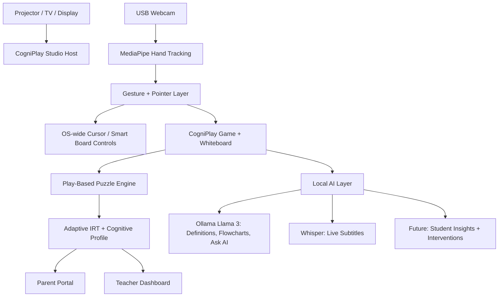
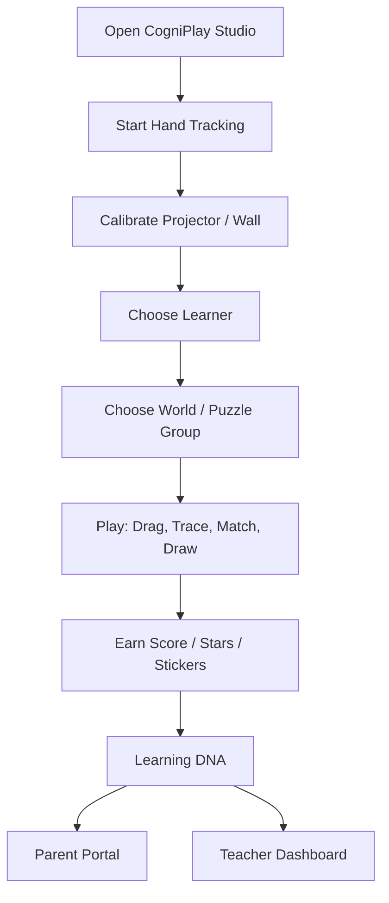

# CogniPlay Studio Rubric-Aligned Deliverables

Challenge: **Early Childhood (3-6)**  
Primary challenge: **1.2 Quality of play-based early learning**  
Extension challenge: **1.1 Access for vulnerable children**  
Product: **CogniPlay Studio / NeoTouch**  
Core proposition: **Turn any projector or TV into an AI-assisted smart learning wall using only a USB webcam and software.**

## Rubric Alignment

| Rubric Area | Weight |
|---|---:|
| 1. Problem framing, user understanding, evidence | 15% |
| 2. AI approach and technical feasibility | 25% |
| 3. Innovation / originality of approach | 10% |
| 4. Solution design and clickable prototype quality | 15% |
| 5. Impact and scale potential | 10% |
| 6. Equity, inclusion, Responsible AI, and language considerations | 20% |
| 7. Implementation plan | 5% |
| **Total** | **100%** |

---

## 1. Problem Framing, User Understanding, Evidence

### Problem Statement

Early childhood education settings often struggle to deliver consistent, high-quality, developmentally appropriate, play-based learning every day. This is especially true in Anganwadi centres, low-resource preschools, migrant communities, remote geographies, tribal areas, and settings where frontline workers have limited time, training, materials, or digital infrastructure.

The problem is not simply a shortage of screens. The real gap is a shortage of **simple, low-cost, facilitator-friendly learning experiences** that help children learn through movement, play, conversation, drawing, storytelling, and guided exploration.

CogniPlay Studio addresses this by turning existing displays, projectors, or TVs into interactive learning surfaces using a USB webcam. It supports play-based cognitive activities, whiteboard teaching, live subtitles, recording, parent visibility, and teacher insights.

### Who Is Affected

| Stakeholder | Pain Point | Need |
|---|---|---|
| Young children aged 3-6 | Limited access to engaging, developmentally appropriate early learning | Play, movement, language, social interaction, creativity |
| Anganwadi workers | Need practical support to run joyful early learning despite large workloads | Ready-to-use activities, simple facilitation, low-cost setup |
| ECCE educators | Need consistent play-based content and child progress visibility | Classroom tools, dashboards, activity suggestions |
| Parents/caregivers | Often do not know child strengths, gaps, or what to try at home | Plain-language child progress and home activities |
| Vulnerable children | Mobility, remoteness, language barriers, and low continuity | Portable profiles, local language access, low-resource delivery |

### Evidence Base

UNICEF India identifies ICDS/Anganwadi centres as the main Government of India delivery platform for preschool education, serving children through **1.37 million Anganwadi centres**. UNICEF also notes that quality early childhood education is linked to higher learning levels in early primary grades. Source: [UNICEF India - Early Childhood Education](https://www.unicef.org/india/what-we-do/early-childhood-education).

India's National Curriculum Framework for the Foundational Stage emphasizes **learning through play** as central to early childhood learning and describes guided play as effective because it combines child direction with adult support. Source: [NCF Foundational Stage 2022](https://www.education.gov.in/sites/upload_files/mhrd/files/NCF_for_Foundational_Stage_20_October_2022.pdf).

NIPUN Bharat frames foundational learning as the basis of all future learning and includes training and support for preschool teachers and Anganwadi workers. Source: [NIPUN Bharat, Ministry of Education](https://dsel.education.gov.in/en/nipun-bharat).

The WHO/UNICEF/World Bank Nurturing Care Framework identifies early learning, responsive caregiving, safety, health, and nutrition as mutually reinforcing foundations for child development. Source: [WHO - Nurturing Care Framework](https://www.who.int/publications/i/item/9789241514064/).

### User Understanding

For young children, the product must be:

- visual
- tactile
- movement-based
- forgiving
- low text
- playful
- non-punitive
- encouraging

For frontline workers and ECCE educators, the product must be:

- easy to start
- low-cost
- usable without complex training
- aligned to developmental goals
- multilingual over time
- useful even when internet is weak
- supportive rather than evaluative or intimidating

For parents, the product must be:

- jargon-free
- strength-based
- action-oriented
- understandable in local language
- focused on home activities, not marks

### Challenge Fit

Primary challenge 1.2 fit:

- CogniPlay provides structured play-based activities: patterns, shapes, sorting, memory, tracing, drawing.
- It gives frontline workers ready-to-use classroom experiences.
- It uses movement and interaction instead of worksheet-style learning.
- It supports the facilitator with AI-generated explanations, flowcharts, and definitions.

Extension challenge 1.1 fit:

- Requires only a USB webcam and any display/projector/TV.
- Can run locally.
- Can support migrant/remote settings if learner profiles and activity packs are made portable.
- Local language support can be added through subtitles, prompt templates, and multilingual content generation.

---

## 2. AI Approach and Technical Feasibility

### AI Philosophy

CogniPlay uses AI as a **teacher support and inclusion layer**, not as a replacement for Anganwadi workers, ECCE educators, parents, or child-led play.

The AI should:

- reduce facilitator workload
- make explanations easier
- improve accessibility
- personalize activities
- support early intervention
- remain human-supervised
- work in low-resource settings where possible

### Current AI Components

| AI / Intelligence Component | Current Status | What It Does | Technical Feasibility |
|---|---|---|---|
| Hand tracking intelligence | Implemented, needs refinement | Uses MediaPipe to track hand landmarks and convert gestures into smart-board interaction | High; already working in prototype |
| Smart whiteboard shape assist | Implemented | Auto-straightens lines and improves circles, rectangles, triangles, and other shapes | High; currently rule/geometry-based rather than ML |
| Ollama Llama 3 for flowcharts, definitions, Ask AI | Mostly implemented | Generates explanations, flowcharts, definitions, and teaching content on the whiteboard | High for local demos; needs guardrails |
| Whisper / whisper.cpp subtitles | Semi-implemented | Transcribes audio chunks locally for live subtitles and recording captions | Medium; depends on local model installation and hardware |
| AI-generated puzzles | Not fully implemented | Intended to generate puzzles matched to child performance | Medium; current runtime still uses procedural generation |
| Adaptive puzzle selection | Implemented | Uses attempt history and IRT-like scoring to adapt difficulty/category | High; statistical rather than LLM-based |
| AI student insights | Semi-implemented / future | Intended to generate intervention recommendations and parent suggestions | Medium; needs real data and responsible AI guardrails |
| Teacher intervention recommendations | Semi-implemented | Dashboard displays alerts/recommendations, currently mock/static | Medium; needs real class data and human review |

### Technical Architecture

### Why This Is Feasible

The project already demonstrates:

- CV Active state in live testing screenshots.
- Smart-board-like interaction using hand tracking.
- Working CogniPlay React app.
- Drag/drop and trace-based puzzle interactions.
- Whiteboard with AI flowchart generation.
- Recording UI with local live subtitle logic.
- Parent and teacher dashboards.
- Successful production build for CogniPlay.
- Successful Node syntax check for the host server.

### What Needs Refinement

- Gesture accuracy across lighting, camera angles, and classroom layouts.
- OS-wide interactions such as undo/redo, window switching, highlighting, and writing.
- Whisper setup flow and performance on low-end devices.
- AI content moderation and age appropriateness.
- Real AI-driven recommendations from actual child data.
- AI puzzle generation with strict schema validation and educator review.

### Responsible AI Technical Guardrails

Planned guardrails:

- Keep AI recommendations advisory, not diagnostic.
- Show "teacher review required" for intervention suggestions.
- Use child-safe prompt templates.
- Prevent answer leakage in puzzle hints.
- Add local-language review and fallback content.
- Avoid storing raw audio/video unless explicitly enabled.
- Keep subtitles and AI processing local where possible.
- Provide confidence and "why" explanations for AI recommendations.

---

## 3. Innovation / Originality of Approach

### What Is Original

CogniPlay is not just another tablet app or smart-board presentation tool. It combines:

1. **Any-display smart-board conversion** using only a USB webcam.
2. **Embodied play-based learning** where children drag, trace, sort, draw, and move.
3. **Local-first AI teaching support** for flowcharts, definitions, explanations, and subtitles.
4. **Adaptive cognitive play** with parent and teacher insight surfaces.
5. **Low-cost hardware strategy** suitable for Anganwadi/ECCE contexts.

### Why It Is Different From Existing Solutions

| Typical Solution | Limitation | CogniPlay Difference |
|---|---|---|
| Smart boards | Expensive hardware | Uses existing projector/TV plus webcam |
| Tablet apps | Individual, screen-bound, less social | Wall-scale, group-friendly, embodied play |
| LMS dashboards | Not designed for preschool play | Focused on 3-6 play and cognitive growth |
| AI chatbots | Text-heavy, not child appropriate | AI supports teacher/whiteboard, not direct child chatbot |
| Worksheets | Static and non-adaptive | Interactive, adaptive, and visual |

### Originality Statement

The originality lies in combining low-cost computer vision, smart-board interaction, AI-assisted teaching, and preschool cognitive play into a single classroom-ready experience.

---

## 4. Solution Design and Clickable Prototype Quality

### Prototype Platform

The current prototype is implemented as a working web/desktop product rather than a Figma-only design:

- Root web host: HTML/CSS/JS
- Game layer: React + TypeScript + Vite
- AI layer: Ollama, Whisper/whisper.cpp
- CV layer: MediaPipe Hands
- OS bridge: Python/macOS cursor control

### Clickable / Testable Screens

Live product-testing screenshots show:

- Landing page
- Home World
- Puzzle Groups
- Sorting puzzle
- Pattern puzzle
- Memory puzzle
- Whiteboard
- AI flowchart on whiteboard
- Recording and subtitle UI
- Learning DNA profile
- Parent dashboard
- Teacher dashboard
- Camera preview of actual projected display

Screenshot evidence is stored at:

`/Users/rajivkhanna/Downloads/NeoTouch/pdf_extracted_images`

### Core User Flow

### Solution Components

| Component | Purpose | Current Quality |
|---|---|---|
| Smart-board host | Turns display into interactive wall | Strong prototype |
| Hand tracking | Enables touch/gesture interaction | Implemented, needs robustness |
| Whiteboard | Teacher explanation and child creativity | Strong prototype |
| AI assist | Flowcharts, definitions, Ask AI | Mostly implemented |
| Live subtitles | Inclusion and recording support | Semi-implemented |
| Recording | Save sessions and share later | Semi-implemented |
| Puzzle engine | Play-based learning activities | Implemented, needs more content |
| Reward economy | Points, stickers, mentors, customization | Planned, not yet implemented |
| Parent portal | Plain-language progress and home actions | Semi-implemented |
| Teacher dashboard | Class insights, heatmap, intervention | Semi-implemented/mock |

### Prototype Quality Assessment

Strengths:

- Working code prototype, not just mockups.
- Live product screenshots show multiple end-to-end screens.
- UX now has a coherent preschool visual language.
- Child copy is simpler and more developmentally appropriate.
- Smart-board and whiteboard story is visually compelling.

Weaknesses:

- Some dashboard data is mock.
- Reward economy is not yet complete.
- Gesture controls need classroom testing.
- Cloud upload is incomplete.
- Multilingual flows are not yet implemented.

---

## 5. Impact and Scale Potential

### Impact Potential

CogniPlay can improve early childhood learning quality by giving frontline workers a simple tool to facilitate:

- pattern recognition
- counting
- shape matching
- memory
- attention
- reasoning
- creative expression
- motor coordination
- group participation

It can also support continuity through:

- parent portal
- home activities
- recorded lessons
- child progress profiles
- portable local learner records in the future

### Why It Can Scale

Hardware requirement is intentionally minimal:

- existing TV or projector
- one good-quality USB webcam
- USB extension cable
- local computer

This is more scalable than dedicated smart-board hardware because the system upgrades existing displays.

### Scale Path

| Phase | Scale Target | Deployment Model |
|---|---|---|
| Pilot | 3-5 classrooms / Anganwadi centres | Local laptop + projector + webcam |
| Validation | 25-50 centres | Offline content packs + facilitator training |
| District rollout | 100+ centres | Device kits + dashboard sync |
| State/national | Large-scale ECCE networks | Cloud dashboard + local-first edge app |

### Measurable Impact Metrics

Child-level:

- attendance/participation
- activities completed
- growth in pattern, memory, counting, and attention tasks
- persistence after errors
- engagement time

Teacher-level:

- sessions run per week
- activities facilitated
- recording/subtitle usage
- intervention follow-through

Parent-level:

- parent portal views
- home activities attempted
- continuity during absence/migration

System-level:

- cost per classroom
- setup time
- offline reliability
- local-language activity coverage

---

## 6. Equity, Inclusion, Responsible AI, and Language Considerations

This section is worth 20% of the rubric and should be central to the pitch.

### Equity Strategy

CogniPlay is designed around low-cost access:

- Does not require expensive smart boards.
- Works with commonly available projectors or TVs.
- Requires only a USB webcam and software.
- Can run locally.
- Supports group learning rather than one-device-per-child dependency.

This matters for:

- Anganwadi centres
- low-resource preschools
- migrant children
- remote communities
- tribal communities
- socio-economically disadvantaged children

### Inclusion Features

| Inclusion Need | Product Response |
|---|---|
| Children with limited literacy | Visual, gesture-based, low-text play |
| Children with hearing barriers | Live subtitles and captioned recordings |
| Children with different motor abilities | Large wall-scale interactions, adjustable gestures needed |
| Multilingual classrooms | Future local-language subtitles, prompts, and instructions |
| Low-resource settings | Local-first, minimal hardware |
| Children absent due to mobility | Future recorded lessons and portable profiles |
| Caregiver support | Parent dashboard and home activities |

### Language Considerations

Current product is primarily English. For the challenge, multilingual support should become a core implementation priority.

Planned language features:

- UI language switcher.
- Activity instructions in local languages.
- Whisper language detection or chosen-language transcription.
- AI-generated definitions in teacher-selected language.
- Parent portal summaries in local language.
- Audio narration for non-reading children.
- Local cultural examples, songs, stories, objects, and animals.

Suggested first languages for Indian ECCE pilots:

- Hindi
- Marathi
- Tamil
- Telugu
- Kannada
- Bengali
- Gujarati
- Odia
- Assamese
- selected tribal/local languages based on pilot geography

### Responsible AI Position

AI should support adult facilitators, not directly judge or label children.

Responsible AI principles:

1. Human-in-the-loop: teachers approve AI recommendations.
2. No diagnosis: the system flags "may need support", not medical/developmental labels.
3. Explainability: recommendations should cite observed behaviors.
4. Data minimization: avoid storing raw video/audio unless needed.
5. Local-first: use local AI for subtitles and classroom content where possible.
6. Bias monitoring: validate recommendations across language, gender, caste, disability, and socio-economic contexts.
7. Child safety: age-appropriate AI outputs only.
8. Privacy by design: parent consent and school controls before cloud sync.

### Responsible AI Risks and Mitigations

| Risk | Mitigation |
|---|---|
| AI suggests inappropriate content | Use locked prompt templates, moderation, teacher approval |
| Child gets mislabeled as weak | Use strengths-based language, avoid diagnostic labels |
| Bias in recommendations | Pilot across diverse contexts and audit model outputs |
| Data privacy risk | Local processing, consent, encryption, minimal data collection |
| Wrong subtitles | Make subtitles editable and mark as AI-generated |
| Over-reliance on AI | Present AI as assistant to teacher, not authority |
| Language exclusion | Prioritize local language UI and voice support |

### Equity-Centered Product Language

Use:

- "support needed"
- "growth area"
- "try at home"
- "teacher review"
- "learning profile"
- "play progress"

Avoid:

- "low performer"
- "delayed"
- "deficient"
- "diagnosed"
- "risk child"
- "AI has determined"

---

## 7. Implementation Plan

### Current Implementation Status

| Feature | Status |
|---|---|
| Turn projector/TV into smart board with webcam hand tracking | Implemented, needs refinement |
| OS-wide controls | Semi-implemented |
| Undo/redo, switch windows, write, highlight with gestures | Partially implemented / planned refinement |
| AI auto-straighten and shape fitting | Implemented through geometry-based shape assist |
| AI flowcharts, definitions, Ask AI | Mostly implemented through Ollama |
| Live lecture subtitles | Semi-implemented through Whisper/whisper.cpp |
| Auto record lecture | Semi-implemented |
| Upload lecture to cloud | Not fully implemented |
| Play-based cognitive games | Implemented, needs more categories/content |
| Drag/drop interactions | Implemented |
| Drawing Studio / creative expression | Implemented |
| Points and achievements | Basic points/badges exist |
| Sticker shop, mentors, customization | Not yet implemented |
| Parent portal | Semi-implemented |
| Individual teacher child statistics | Semi-implemented |
| Class teacher dashboard | Semi-implemented/mock |
| AI intervention recommendations | Planned / mock today |

### 0-1 Month: Prototype Hardening

- Improve gesture stability for undo/redo, switching windows, writing, and highlighting.
- Add setup checklist for webcam, lighting, calibration, and projector alignment.
- Add visible fallback when Whisper is not installed.
- Add export button for recorded sessions.
- Add more preschool puzzle examples in patterns, shapes, counting, memory, and tracing.
- Add UI labels showing "prototype data" on mock teacher dashboard.

### 1-3 Months: Pilot-Ready Product

- Build real learner/class database.
- Add teacher login and parent login.
- Add class roster and child profile management.
- Implement sticker shop and customization economy.
- Add local language UI for at least Hindi plus one pilot-state language.
- Add lesson plan mode for Anganwadi workers.
- Add AI-generated teacher session summaries.
- Add parent take-home cards.
- Add offline-first content packs.

### 3-6 Months: Evidence and Scale

- Run pilots in ECCE/Anganwadi-like settings.
- Collect engagement, activity completion, and facilitator feedback.
- Validate whether scores correlate with teacher observations.
- Build district/admin dashboard.
- Add cloud sync with consent and privacy controls.
- Add cloud upload for lecture recordings.
- Add multilingual speech-to-text and text-to-speech.
- Add model output audit logs.

### 6-12 Months: Platform Expansion

- Add intervention planning workflow.
- Add teacher-created activities.
- Add culturally localized content packs.
- Add disability-friendly interaction modes.
- Add reporting aligned with NCF Foundational Stage goals.
- Add integration with school/ECCE systems where relevant.
- Add remote continuity tools for migrant children.

### Future Features

Reward and motivation:

- sticker shop
- mentors/companions
- classroom group rewards
- printable certificates
- in-person reward linkage

Teacher support:

- AI lesson generator
- AI intervention drafts
- class grouping suggestions
- daily activity calendar
- local-language story/rhyme generator

Parent support:

- WhatsApp-ready weekly summaries
- local-language home activities
- voice notes for low-literacy caregivers
- caregiver-child play prompts

Access and continuity:

- portable child profile
- offline sync
- migrant child transfer support
- community worker mode

Responsible AI:

- recommendation explanations
- confidence levels
- teacher approval logs
- bias and fairness audit dashboard

## Final Judge-Facing Summary

CogniPlay Studio directly addresses the challenge of improving quality and continuity in early childhood play-based learning. It gives Anganwadi workers and ECCE educators a low-cost smart learning wall using only a webcam and existing display. Children learn through movement, tracing, sorting, drawing, memory, and play. Teachers get AI-supported explanations, whiteboard tools, subtitles, recording, and dashboards. Parents get plain-language growth summaries and home activities.

The solution is original because it combines smart-board conversion, play-based learning, local AI, and early intervention insights into one low-cost classroom system. Its main next step is to move from strong prototype to validated pilot by adding real data, multilingual support, privacy safeguards, and classroom deployment workflows.

